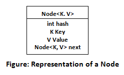
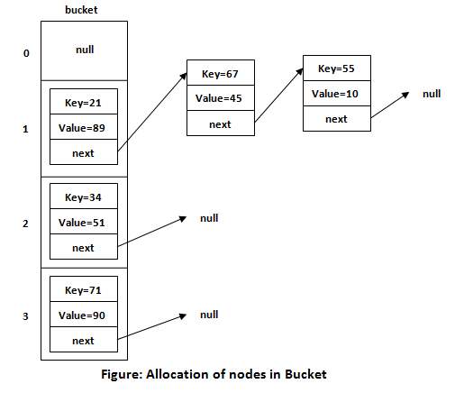

# How to check if an element exists in a list

### 1. HashMap / HashSet / HashTable

A HashMap is a map used to store mappings of key-value pairs.
It is a data structure which allows us to store object and retrieve it in constant time O(1) provided we know the key.

HashMap contains an array of the nodes, and the node is represented as a class. 
It uses an array and LinkedList data structure internally for storing Key and Value.



Before understanding the internal working of HashMap, you must be aware of hashCode() and equals() method.

* **equals()**: It checks the equality of two objects, whether they are equal or not. It is a method of the Object class which can be overridden.
  If you override the equals() method, then it is mandatory to override the hashCode() method.
* **hashCode()**: The **INTEGER** value received from this method is used as the bucket number. The bucket number is the address of the element inside the map. 
  Hash code of null Key is 0.
* **Buckets**: The array of the node is called buckets. Each node has a data structure like a LinkedList. More than one node can share the same bucket.




##### What put() Method Does

* Step 1. The key object is checked for null, and if true the value is stored in  table[0] position, because hashcode for null is always 0.
* Step 2. A hash value is calculated using the key’s hash code by calling its ***hashCode()*** method. 
This hash value is used to calculate the index in the array for storing the Entry objects. 
```
NOTE: JDK designers well assumed that there might be some poorly written  hashCode() functions that can return very high or low hash code value.<br> 
To solve this issue, they introduced another hash() function and passed the object’s hash code to this hash() function to bring hash value in the range of array index size.

```

* Step 3.
Now the indexFor(hash, table.length) the function is called to calculate the exact index position for storing the Entry object.
  
```index = hash(key) & (n-1)``` 

##### How Collisions Are Resolved

Now, as we know that two unequal objects can have the same hash code value, these two different objects will be stored in the same array location called a bucket.
The Entry class has an attribute "next." This attribute always points to the next object in the chain. This is exactly the behavior of the LinkedList.

So, in case of collision, Entry objects are stored in a linked list form. 
When an Entry object needs to be stored in a particular index, HashMap checks whether there is already an entry. 
* If there is no entry already present, the entry object is stored in this location.
* If there is already an object sitting on a calculated index, its next attribute is checked. 
  * If it is null, and the current entry object becomes the next node in LinkedList. 
  * If the next variable is not null, the procedure is followed until the next is evaluated as null.

###### What if we add another value object with the same key as entered before? 
After determining the index position of the Entry object, while iterating over LinkedList on the calculated index, HashMap calls equals method on the key object for each entry object. <br>
All these entry objects in LinkedList will have similar **hashcode()** but **equals()**  method will test for true equality. <br>
If key.equals(k) will be true then both keys are treated as the same key object. This will cause the replacement of value objects inside the entry object only.


As you can see, for storing N objects we would need an object storage of size N, with ~O(1) lookup.
However, as the size of the list increases, we might need a different approach.

### 2. BloomFilter

A Bloom filter is **a space-efficient probabilistic data structure**, conceived by Burton Howard Bloom in 1970, that is used to test whether an element is a member of a set.  
**False positive matches are possible, but false negatives are not** – in other words, **a query returns either "possibly in set" or "definitely not in set"**.  
Elements can be added to the set, but not removed (though this can be addressed with the counting Bloom filter variant); the more items added, the larger the probability of false positives.

A Bloom filter is a data structure designed to tell you, rapidly and memory-efficiently, whether an element is present in a set.

The price paid for this efficiency is that a Bloom filter is a probabilistic data structure: it tells us that the element either definitely is not in the set or may be in the set.

The base data structure of a Bloom filter is a Bit Vector. Here's a small one we'll use to demonstrate:

|  |  |  |  |  |   |   |   |   |  |  |  |  |   |  |
|---|---|---|---|---|---|---|---|---|---|---|---|---|---|---|
|0|1|2|3|4|5|6|7|8|9|10|11|12|13|14

Each empty cell in that table represents a bit, and the number below it its index. 
To add an element to the Bloom filter, we simply hash it a few times (using different hashing algorithms) and set the bits in the bit vector at the index of those hashes to 1.

eg. let's add the following strings "test", "some", "strings" to the bloom filter

Fnv and Murmur are two simple hash functions:

| original string | Fnv hash | Murmur hash |
|---|---|---|
| test | 0 | 10 |
| some | 6 | 13|
| strings |8 | 8 |

for "test" we set the positions in the original bit array as

|T|  |  |  |  |   | |   |T |  |  |  |  |   |  |
|---|---|---|---|---|---|---|---|---|---|---|---|---|---|---|
|0|1|2|3|4|5|6|7|8|9|10|11|12|13|14

for "some" we set the positions in the above bit array as

|T|  |  |  |  | |T|   |T |  |  |  |  |T |  |
|---|---|---|---|---|---|---|---|---|---|---|---|---|---|---|
|0|1|2|3|4|5|6|7|8|9|10|11|12|13|14

for "strings" we set the positions in the above bit array as

|T|  |  |  |  | |T|   |T |  |  |  |  |T |  |
|---|---|---|---|---|---|---|---|---|---|---|---|---|---|---|
|0|1|2|3|4|5|6|7|8|9|10|11|12|13|14

To test for membership, you simply hash the string with the same hash functions, then see if those values are set in the bit vector.  
**If they aren't, you know that the element isn't in the set.   
If they are, you only know that it might be***, because another element or some combination of other elements could have set the same bits. 

###Hash Functions
The hash functions used in a Bloom filter should be independent and uniformly distributed. 
They should also be as fast as possible (cryptographic hashes such as sha1, though widely used therefore are not very good choices).

Examples of fast, simple hashes that are independent enough3 include **murmur, the fnv series of hashes, and HashMix**.


### 3. Count-Min Sketch

Let’s say we want to count the number of times elements appear in a stream of data. A simple solution is to maintain a hash table that maps elements to their frequencies.

This approach does not scale: Imagine having a stream with billions of elements, most of which are unique. Even if we are only interested in the most important ones, this method has huge space requirements. Since we do not know for which items to store counts, our hash table will grow to contain billions of elements.

The Count-Min Sketch, or CMS for short, is a data structure that solves this problem in an approximate way. Similarly to Bloom Filters, we save a lot of space by using probabilistic techniques. In fact, a CMS works a bit like a Counting Bloom Filter, though they do have different use cases.

Given that we only have limited space availability, it would help if we could get away with not storing elements themselves but just their counts. To this end, let’s try to use only an array, with w memory cells, for storing counts.

Consider the matrix below

|    | 0 | 1 | 2 | 3 | 4 | 5 | 6 | 7 | 8 | 9 |
|----|---|---|---|---|---|---|---|---|---|---|
| H1 | 0 | 0 | 0 | 0 | 0 | 0 | 0 | 0 | 0 | 0 |
| H2 | 0 | 0 | 0 | 0 | 0 | 0 | 0 | 0 | 0 | 0 |
| H3 | 0 | 0 | 0 | 0 | 0 | 0 | 0 | 0 | 0 | 0 |
| H4 | 0 | 0 | 0 | 0 | 0 | 0 | 0 | 0 | 0 | 0 |

where H1, H3, H3 are our hash functions, and the matrix values are the counters for the indices (initally all zero)

For each incoming string in our input data stream, we calculate the Hashes H1, H2, H3, and increment the value of index

Lets see this with an example  
Say, we have a stream of Data  
Stream = {A,A,B,A,B,D,A……..}  
say H1(A) = 1, H2(A) = 3, H3(A) = 1, H4(A) = 2  
and H1(B) = 3 ,H2(B) = 5, H3(B) = 1, H4(B) = 2  
and H1(D) = 1 ,H2(D) = 5, H3(D) = 4, H4(D) = 4  

Now lets process the stream element by element,  
We first have A, so we have the matrix as

|    | 0 | 1 | 2 | 3 | 4 | 5 | 6 | 7 | 8 | 9 |
|----|---|---|---|---|---|---|---|---|---|---|
| H1 | 0 | 1 | 0 | 0 | 0 | 0 | 0 | 0 | 0 | 0 |
| H2 | 0 | 0 | 0 | 1 | 0 | 0 | 0 | 0 | 0 | 0 |
| H3 | 0 | 1 | 0 | 0 | 0 | 0 | 0 | 0 | 0 | 0 |
| H4 | 0 | 0 | 1 | 0 | 0 | 0 | 0 | 0 | 0 | 0 |

as you can see we have incremented the value at indices provided by hash functions by 1


Now we go to the next element, which is again A ,so our matrix becomes  

|    | 0 | 1 | 2 | 3 | 4 | 5 | 6 | 7 | 8 | 9 |
|----|---|---|---|---|---|---|---|---|---|---|
| H1 | 0 | 2 | 0 | 0 | 0 | 0 | 0 | 0 | 0 | 0 |
| H2 | 0 | 0 | 0 | 2 | 0 | 0 | 0 | 0 | 0 | 0 |
| H3 | 0 | 2 | 0 | 0 | 0 | 0 | 0 | 0 | 0 | 0 |
| H4 | 0 | 0 | 2 | 0 | 0 | 0 | 0 | 0 | 0 | 0 |

The next element is B, and since we have and H1(B) = 3 ,H2(B) = 5, H3(B) = 1, H4(B) = 2     
, so our matrix now is

|    | 0 | 1 | 2 | 3 | 4 | 5 | 6 | 7 | 8 | 9 |
|----|---|---|---|---|---|---|---|---|---|---|
| H1 | 0 | 2 | 0 | 1 | 0 | 0 | 0 | 0 | 0 | 0 |
| H2 | 0 | 0 | 0 | 2 | 0 | 1 | 0 | 0 | 0 | 0 |
| H3 | 0 | 3 | 0 | 0 | 0 | 0 | 0 | 0 | 0 | 0 |
| H4 | 0 | 0 | 3 | 0 | 0 | 0 | 0 | 0 | 0 | 0 |

similarly, next elements being A followed by B get the matrix updated to 

|    | 0 | 1 | 2 | 3 | 4 | 5 | 6 | 7 | 8 | 9 |
|----|---|---|---|---|---|---|---|---|---|---|
| H1 | 0 | 3 | 0 | 2 | 0 | 0 | 0 | 0 | 0 | 0 |
| H2 | 0 | 0 | 0 | 3 | 0 | 2 | 0 | 0 | 0 | 0 |
| H3 | 0 | 5 | 0 | 0 | 0 | 0 | 0 | 0 | 0 | 0 |
| H4 | 0 | 0 | 5 | 0 | 0 | 0 | 0 | 0 | 0 | 0 |

Now for D, with hashes H1(D) = 1 ,H2(D) = 5, H3(D) = 4, H4(D) = 4 

|    | 0 | 1 | 2 | 3 | 4 | 5 | 6 | 7 | 8 | 9 |
|----|---|---|---|---|---|---|---|---|---|---|
| H1 | 0 | 4 | 0 | 2 | 0 | 0 | 0 | 0 | 0 | 0 |
| H2 | 0 | 0 | 0 | 3 | 0 | 3 | 0 | 0 | 0 | 0 |
| H3 | 0 | 5 | 0 | 0 | 1 | 0 | 0 | 0 | 0 | 0 |
| H4 | 0 | 0 | 5 | 0 | 1 | 0 | 0 | 0 | 0 | 0 |

Followed by A, resulting in 

|    | 0 | 1 | 2 | 3 | 4 | 5 | 6 | 7 | 8 | 9 |
|----|---|---|---|---|---|---|---|---|---|---|
| H1 | 0 | 5 | 0 | 2 | 0 | 0 | 0 | 0 | 0 | 0 |
| H2 | 0 | 0 | 0 | 4 | 0 | 3 | 0 | 0 | 0 | 0 |
| H3 | 0 | 6 | 0 | 0 | 1 | 0 | 0 | 0 | 0 | 0 |
| H4 | 0 | 0 | 6 | 0 | 1 | 0 | 0 | 0 | 0 | 0 |


Now, lets try to find the count of A,   
For this we pass A to the hash functions, we get H1(A) = 1, H2(A) = 3, H3(A) = 1, H4(A) = 2  
Now take the array of these positions in matrix which comes to {5,4,6,6} .. The minimum of this comes to 4, so the frequency of A is 4.

Similarly, Lets calculate frequency of B with hashes H1(B) = 3 ,H2(B) = 5, H3(B) = 1, H4(B) = 2  
the frequency = min {2,3,6,6} = 2

for D, we have H1(D) = 1 ,H2(D) = 5, H3(D) = 4, H4(D) = 4
and the frequency = min {5, 3, 1, 1} = 1

In this way Count min sketch allows to calculate frequency of large data streams in sub linear space using same O(1) constant time complexity.

Count-Min Sketches are incredibly efficient.   
A 1000x8 Count-Min Sketch (that is, 8 hash functions that each map to a 1000-length array), would need to store eight-thousand 32-bit integers. That’s a total of 32 KB — literally orders of magnitudes smaller than the massive 32 GB Hash Table we were contemplating earlier!

### 4. HyperLogLog

HyperLogLog is an algorithm for the **count-distinct problem**: approximating the number of distinct elements in a multiset.  
Calculating the exact cardinality of a multiset requires an amount of memory proportional to the cardinality, which is impractical for very large data sets. Probabilistic cardinality estimators, such as the HyperLogLog algorithm, use significantly less memory than this, at the cost of obtaining only an approximation of the cardinality.  
The HyperLogLog algorithm is able to estimate cardinalities of > 10<sup>9</sup> with a typical accuracy (standard error) of 2%, using 1.5 kB of memory.

The basis of the HyperLogLog algorithm is the observation that the cardinality of a multiset of uniformly distributed random numbers can be estimated by calculating the maximum number of leading zeros in the binary representation of each number in the set. If the maximum number of leading zeros observed is n, an estimate for the number of distinct elements in the set is 2n.

In the HyperLogLog algorithm, a hash function is applied to each element in the original multiset to obtain a multiset of uniformly distributed random numbers with the same cardinality as the original multiset. The cardinality of this randomly distributed set can then be estimated using the algorithm above.

The simple estimate of cardinality obtained using the algorithm above has the disadvantage of a large variance. In the HyperLogLog algorithm, the variance is minimised by splitting the multiset into numerous subsets, calculating the maximum number of leading zeros in the numbers in each of these subsets, and using a harmonic mean to combine these estimates for each subset into an estimate of the cardinality of the whole set.


### 5. Min Hash

In computer science, MinHash (or the min-wise independent permutations locality sensitive hashing scheme) is a technique for quickly estimating how similar two sets are. The scheme was invented by Andrei Broder (1997), and initially used in the AltaVista search engine to detect duplicate web pages and eliminate them from search results. It has also been applied in large-scale clustering problems, such as clustering documents by the similarity of their sets of words.


### 6. Locality-sensitive hashing

In computer science, locality-sensitive hashing (LSH) is an algorithmic technique that hashes similar input items into the same "buckets" with high probability. (The number of buckets are much smaller than the universe of possible input items.) 

Since similar items end up in the same buckets, this technique can be used for data clustering and nearest neighbor search. It differs from conventional hashing techniques in that hash collisions are maximized, not minimized. Alternatively, the technique can be seen as a way to reduce the dimensionality of high-dimensional data; high-dimensional input items can be reduced to low-dimensional versions while preserving relative distances between items.

